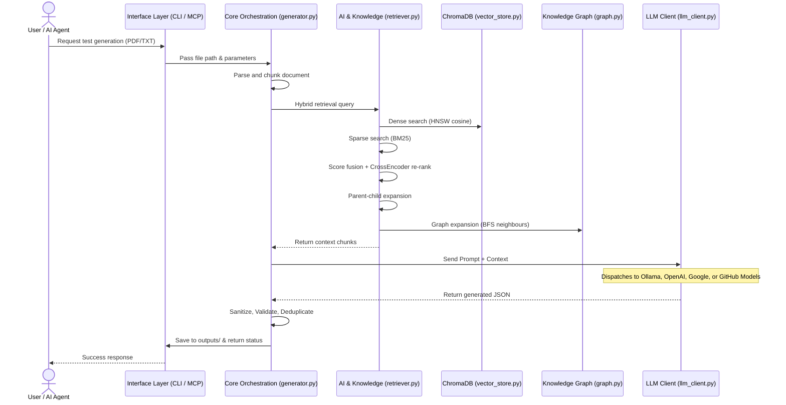

# CaseCraft

CaseCraft is an Agentic QA Engine that transforms feature requirement documents into structured, production-ready test suites. It uses local or cloud-based LLMs, Retrieval-Augmented Generation (RAG), and multiple integration interfaces — CLI and MCP Server — to generate comprehensive test cases grounded in your product's existing documentation.

---

## Architecture Diagram



---

## Architecture Layers

CaseCraft follows a modular three-tier architecture. Each layer has a clear responsibility and communicates with the others through well-defined interfaces.

### Layer 1: Interface Layer

The Interface Layer is the entry point for all interactions with CaseCraft. Whether a user runs a terminal command or an AI agent makes a tool call, this layer normalizes the request and hands it off to the Core Orchestration Layer. This separation ensures that the underlying test generation logic remains identical regardless of how CaseCraft is invoked.

**`cli/main.py`** — The primary CLI entry point. It uses Python's `argparse` to accept commands like `generate`, along with flags such as `--model`, `--format`, `--output` / `-o`, `--no-dedup-semantic`, `--reviewer` / `--quality`, and `--verbose`. It resolves configuration priority (CLI arguments override config file values, which override defaults), validates input file paths, calls `generate_test_suite()`, and exports results via `core/exporter.py`. After generation, it automatically unloads the model from Ollama memory to free resources. This is the recommended way to run CaseCraft for local usage.

**`cli/ingest.py`** — The ingestion CLI for populating the RAG knowledge base. It supports four sub-commands: `sitemap` (crawl all pages from a sitemap.xml), `url` (ingest a single web page), `urls` (ingest URLs from a text file), and `docs` (ingest local PDF/TXT/MD files from a directory). Each source is parsed into `RawDocument` objects, chunked, embedded, and appended to the knowledge index.

**`mcp_server/server.py`** — Exposes CaseCraft as an MCP (Model Context Protocol) server using FastMCP. It defines two tools: `generate_tests` and `query_knowledge`, which AI clients like AnythingLLM or Claude Desktop can invoke. The server implements critical security measures including path sandboxing (files must be in `features/`, `specs/`, or `docs/`), rate limiting (5-second cooldown between generation calls), input validation (app_type whitelist, query truncation), and lazy loading of heavy dependencies (PyTorch, SentenceTransformers) so that the MCP handshake completes instantly without timeout.

**`casecraft_mcp.py`** — A thin wrapper script that adds the project root to `sys.path` and calls `mcp_server.server.main()`. This is the file you point your MCP client to when configuring the server.

### Layer 2: Core Orchestration Layer

This is the central processing engine. It manages the entire pipeline: parsing documents, consulting the knowledge base, constructing prompts, calling the LLM, and post-processing results.

**`core/generator.py`** — The main orchestrator containing `generate_test_suite()`. This function:

1. Parses the input document into text chunks using `core/parser.py`.
2. Retrieves product context from the RAG knowledge base via `_retrieve_product_context()`.
3. For each chunk, runs a condensation pass (`_condense_chunk()`) to distill the text into test-relevant bullet points, then builds a prompt and generates test cases via `_generate_single_suite()`.
4. Checks each chunk against `min_cases_per_chunk` — if a chunk produces fewer test cases than the threshold, a supplementary LLM call is made focusing on edge cases, boundary values, and negative tests.
5. Processes all chunks in parallel using `ThreadPoolExecutor` (up to 4 workers) since LLM calls are I/O-bound.
6. Post-processes results through a multi-stage pipeline: JSON sanitization (`_clean_json_output`), output normalization (`_normalize_test_cases`), field sanitization (`_sanitize_test_cases`), title cleaning (`_clean_test_case_titles`), exact deduplication (`_deduplicate_test_cases`), semantic deduplication (`_deduplicate_semantically`), checklist cross-referencing (if a companion `_checklist.txt` file exists), priority sorting (`_prioritize_test_cases`), and dependency validation (`_validate_dependencies`).
7. Optionally runs a reviewer pass that sends the entire suite back to the LLM for polish.
8. Returns a validated `TestSuite` Pydantic model.

**`core/parser.py`** — Handles document ingestion. Supports PDF (via `pypdf`), plain text, and Markdown files. It extracts raw text, cleans it (strips redundant whitespace, normalizes line endings), and splits it into overlapping chunks. The chunker prefers to break at whitespace boundaries so words are never split mid-token. Enforces a 50MB file size limit to prevent memory exhaustion.

**`core/prompts.py`** — Manages prompt construction using Jinja2 templates stored in `prompts/templates/`. It provides four builder functions:

- `build_generation_prompt()` — The main prompt instructing the LLM to generate test cases from feature text plus optional product context.
- `build_condensation_prompt()` — Reduces a document chunk to concise, test-relevant bullet points.
- `build_reviewer_prompt()` — Instructs the LLM to review and improve an existing test suite.
- `build_cross_reference_prompt()` — Compares an existing test suite against a checklist and generates only the missing test cases.

All inputs are sanitized via `_sanitize_input()` which strips control characters, enforces a 500K character limit, and runs **prompt-injection fencing** (R1) — a set of regex heuristics that detect common injection patterns (instruction overrides, role reassignment, fake message boundaries, prompt leakage attempts, jailbreak phrases) and wrap flagged lines with an explicit data-fence marker so the LLM treats them as content, not instructions.

**`core/schema.py`** — Defines the data model using Pydantic. `TestCase` contains fields for use_case, test_case name, test_type (functionality, ui, performance, integration, usability, database, security, acceptance), preconditions, test_data (arbitrary key-value pairs), steps, priority, dependencies, tags, expected_results, and actual_results. `TestSuite` wraps a list of `TestCase` objects with the feature name and source document path.

**`core/config.py`** — Manages configuration loading with a three-level priority system: CLI arguments > Environment variables > YAML config file > Defaults. The config is defined as Pydantic models (`GeneralSettings`, `GenerationSettings`, `OutputSettings`, `QualitySettings`, `KnowledgeSettings`) and loaded from `casecraft.yaml`. Any setting can be overridden via environment variables using the convention `CASECRAFT_SECTION_KEY` (e.g., `CASECRAFT_GENERAL_MODEL`).

**`core/exporter.py`** — Exports a `TestSuite` to Excel (`.xlsx` via openpyxl) or JSON format. Includes path traversal protection — output files must be within the configured `output_dir`. The `_join_lines()` helper safely coerces non-string items to strings before joining.

**`core/cache.py`** — Thread-safe caching infrastructure with three specialised LRU caches: `CondensationCache` (caches LLM condensation results by content hash), `RetrievalCache` (caches RAG retrieval results by query hash with configurable TTL), and `PromptCache` (caches rendered Jinja2 templates by parameter hash). All caches support hit/miss stats tracking, `clear()`, and concurrent access via `threading.Lock`. BM25 disk persistence (`bm25_cache.pkl`) and secondary metadata indexes are also managed here.

**`core/chunking.py`** — Shared chunking module used by both `core/parser.py` (for feature documents) and `core/knowledge/chunker.py` (for knowledge base ingestion). Provides `recursive_split()` with a separator hierarchy (`\n\n` → `\n` → `.` → `;` → `,` → ` ` → character) and section-aware splitting logic. This deduplication ensures consistent chunking behaviour across both pipelines.

**`core/llm_client.py`** — A unified LLM adapter that routes generation requests to one of four backends based on config:

- **Ollama** (native `/api/generate` endpoint) — For locally hosted models.
- **OpenAI-compatible** (`/v1/chat/completions`) — Works with LM Studio, LocalAI, vLLM, and any OpenAI-compatible API.
- **Google Gemini** (REST API) — For Google's cloud models.
- **GitHub Models** (`copilot` provider) — Routes through GitHub's Models API at `https://models.github.ai/inference`. Supports GPT-4o, GPT-4.1, GPT-5, o3-mini, o4-mini, DeepSeek-R1, Llama, Phi-4, Grok, and more. Requires a GitHub PAT with `models:read` scope.

Each backend handler constructs the appropriate payload with temperature, top_p, max output tokens, and context window settings. It warns if API keys are transmitted over unencrypted HTTP to non-localhost addresses. After generation completes, the client can unload models from Ollama memory via `unload_model()` to free resources.

### Layer 3: AI & Knowledge Layer (RAG)

This layer handles all embedding, storage, and retrieval of product knowledge that provides context during test generation.

**`core/knowledge/models.py`** — Defines two data classes: `RawDocument` (text + source metadata before chunking) and `KnowledgeChunk` (text + metadata + optional embedding vector after chunking).

**`core/knowledge/chunker.py`** — Splits `RawDocument` text into `KnowledgeChunk` objects using three strategies:

- **Section-aware chunking** — Splits by paragraphs, then merges into chunks up to a configurable `max_chars` limit (default 1500 characters via `knowledge.kb_chunk_size`), preserving semantic boundaries.
- **Recursive chunking** — Uses a separator hierarchy (`\n\n` → `\n` → `.` → `;` → `,` → ` ` → character) to split oversized sections, progressively falling back to finer-grained separators.
- **Parent-child chunking** — Two-tier strategy where large parent chunks (for rich context) are sub-split into small child chunks (for retrieval precision). Child chunks carry `parent_id` metadata so the retriever can expand them back to parent context at query time. Enabled via `knowledge.parent_child_chunking`.

**`core/knowledge/vector_store.py`** — Persistent vector storage backed by **ChromaDB**. Wraps a `chromadb.PersistentClient` with HNSW cosine-distance indexing. Provides `add_chunks()`, `query()`, `get_by_ids()`, `get_all()`, and `reset_collection()` methods. Includes an auto-migration path from the legacy flat JSON index (`knowledge_base/index.json`) to ChromaDB on first access.

**`core/knowledge/graph.py`** — A lightweight **knowledge graph** built with `networkx`. At ingest time, `KnowledgeGraph.build_from_chunks()` constructs a directed graph with four relation types:

1. **`parent_of`** — Links parent chunks to their child chunks (from parent-child chunking metadata).
2. **`same_source`** — Links consecutive chunks from the same source document.
3. **`cross_reference`** — Links chunks that mention another document's source name in their text.
4. **`shared_entity`** — Links chunks that share significant noun phrases, acronyms, or quoted terms (lightweight entity extraction without spaCy).

The graph persists to JSON via `networkx.readwrite.json_graph` and supports BFS traversal (`get_related_ids()`) with configurable max hops and optional relation filtering.

**`core/knowledge/embedder.py`** — Generates dense vector embeddings using SentenceTransformers (`all-MiniLM-L6-v2` by default, 384 dimensions). Supports batch processing with progress bars. When the retriever is already loaded, the embedder reuses the same model instance to save memory.

**`core/knowledge/retriever.py`** — The advanced hybrid retrieval engine. Init is near-instant (~0.05s) because ChromaDB persists on disk and ML models are loaded lazily in a background thread. The retrieval pipeline has seven stages:

1. **Dense Search** — HNSW cosine similarity via ChromaDB (weighted at 0.7 by default).
2. **Sparse Search (BM25)** — Keyword-based scoring via `rank_bm25` (weighted at 0.3 by default).
3. **Score Fusion** — Combines dense and sparse scores with configurable weights.
4. **Cross-Encoder Re-ranking** — Optionally re-ranks the top candidates using `cross-encoder/ms-marco-MiniLM-L-6-v2` for improved precision.
5. **Parent-Child Expansion** — Replaces matched child chunks with their richer parent chunks for broader context.
6. **Knowledge Graph Expansion** — Appends structurally related chunks (same source, cross-references, shared entities) found via BFS traversal of the knowledge graph, catching connections that embedding similarity misses.
7. **Filtering** — Applies minimum score threshold and metadata filters.

Also supports **batched multi-query retrieval**: long feature texts are decomposed into sub-queries, batch-encoded, and fused via max-score aggregation before re-ranking. Supports `top_k=-1` to retrieve all chunks.

**`core/knowledge/loader.py`** — Scans a directory for supported files (PDF, MD, TXT), extracts text using `core/parser.py`, and wraps each file as a `RawDocument` with automatically inferred source types (feature_doc, system_rule, product_doc).

**`core/knowledge/web_loader.py`** — Fetches content from web sources. Supports sitemap crawling (with configurable delay, max pages, and URL exclusion patterns), single URL loading, and batch URL loading from text files. Implements SSRF protection: blocks private/internal IPs, validates DNS resolution, rejects non-HTTP schemes, and limits redirect chains.

**`core/knowledge/ingest.py`** — Orchestrates the full ingestion pipeline: loads documents via `loader.py` or `web_loader.py`, chunks them via `chunker.py`, embeds via `embedder.py`, stores in ChromaDB via `vector_store.py`, and optionally builds the knowledge graph via `graph.py`. Returns an `IngestResult` with chunk count, source count, and graph statistics.

**`core/knowledge/integrity.py`** — SHA-256 hash-based integrity verification for the legacy `index.json` migration path. Provides `compute_hash()`, `write_hash()`, and `verify_hash()` functions to detect tampering or corruption of the flat JSON index before migrating chunks to ChromaDB.

---

## Tech Stack

| Component | Technology | Purpose |
| --- | --- | --- |
| **Language** | Python 3.10+ | Core runtime for all modules |
| **LLM Communication** | `requests` | HTTP client for Ollama, OpenAI, and Google Gemini REST APIs |
| **Data Validation** | `pydantic` v2 | Schema enforcement for config, test cases, and LLM output |
| **PDF Parsing** | `pypdf` | Text extraction from PDF feature documents |
| **Excel Export** | `openpyxl` | Writing structured test suites to `.xlsx` files |
| **Configuration** | `pyyaml` | Loading `casecraft.yaml` settings |
| **Prompt Templating** | `jinja2` | Rendering parameterized prompts for the LLM |
| **Embeddings** | `sentence-transformers` (`all-MiniLM-L6-v2`) | Generating dense vector embeddings for RAG retrieval and semantic deduplication |
| **Re-ranking** | `sentence-transformers` (`cross-encoder/ms-marco-MiniLM-L-6-v2`) | Cross-encoder re-ranking of retrieval candidates for higher precision |
| **Vector Database** | `chromadb` (v≥0.5.0) | Persistent HNSW vector store with cosine distance indexing |
| **Knowledge Graph** | `networkx` (v≥3.1) | In-memory directed graph for cross-document chunk relationship tracing |
| **Sparse Search** | `rank-bm25` | BM25Okapi keyword scoring for hybrid search |
| **Web Scraping** | `beautifulsoup4` | HTML-to-text extraction for web ingestion |
| **XML Parsing** | `defusedxml` | Safe sitemap.xml parsing (prevents XXE attacks) |
| **MCP Server** | `mcp` (FastMCP) | Model Context Protocol server for AI agent integration |
| **Numerical** | `numpy` | Matrix operations for cosine similarity and score computation |
| **Progress Display** | `tqdm` | Progress bars for multi-chunk generation and batch processing |

**Why these choices:**

- **Pydantic** ensures every LLM output strictly conforms to the `TestCase` schema. Without it, malformed JSON from the LLM would silently corrupt test suites.
- **Jinja2** separates prompt logic from prompt content, making it easy to modify prompts without touching Python code.
- **SentenceTransformers** provides high-quality local embeddings without requiring an API key or internet connection.
- **Hybrid Search (BM25 + Dense)** catches both exact keyword matches and semantic similarities, outperforming either approach alone.
- **FastMCP** enables zero-code integration with AI assistants like Claude Desktop and AnythingLLM.

---

## Recent Improvements

CaseCraft has been enhanced with the following features and optimizations:

### Dynamic Token Allocation with Per-Model Caps

- **Auto-detection**: Automatically detects the model's native context window from Ollama API (`/api/show`); cloud models use per-model specs from `MODEL_SPECS`
- **Context window ratio**: `context_window_ratio` (0.0–1.0) controls how much of the native window to use — e.g., 0.75 = 75%
- **Dynamic output tokens**: Output token budget is computed dynamically from the actual prompt size — small prompts get more output budget, large prompts get less
- **Per-model caps**: Each model in `MODEL_SPECS` has a hard output ceiling (e.g., gpt-4o: 16,384) that prevents 400 errors from the provider
- **Minimum guarantee**: `min_output_tokens` (default 1024) ensures output is never starved even with very large prompts

### Advanced RAG Query Transformations

- **Query decomposition**: Long feature chunks are decomposed into focused sub-queries for more precise retrieval
- **Query expansion**: Domain-specific synonyms (e.g., "login" → "authentication", "sign in") improve recall
- **Per-chunk KB retrieval**: Each feature chunk gets its own knowledge context, ranked by relevance

### Improved Reliability

- **HTTP retry with exponential backoff**: Transient errors (429, 503, 504) trigger automatic retries with jitter
- **Thread-safe singletons**: Retriever and embedder instances use double-checked locking
- **Schema validation**: Priority and test_type fields are normalized and validated with `Literal` types
- **Robust LLM output normalization**: `_coerce_str_list()` handles malformed LLM responses where list fields (steps, preconditions, expected_results) contain dicts instead of strings — e.g., `[{"step": 1, "action": "Click"}]` is flattened to `["step: 1, action: Click"]`. Mixed-type lists and bare strings are also handled gracefully

### Better User Experience

- **Progress bars**: tqdm progress indicators for KB retrieval and test generation
- **Structured logging**: All `print()` calls replaced with Python's `logging` module
- **Configurable verbosity**: Use `--verbose` flag for debug output

### ChromaDB Vector Store

- **Persistent HNSW indexing**: Replaced the flat JSON index with ChromaDB's persistent client, providing HNSW approximate nearest-neighbour search with cosine distance
- **Auto-migration**: On first access, if ChromaDB is empty but a legacy `knowledge_base/index.json` exists, chunks are automatically migrated
- **Batch operations**: `add_chunks()`, `query()`, `get_by_ids()`, `get_all()`, and `reset_collection()` with proper error handling

### Advanced Chunking Strategies

- **Recursive chunking**: Separator hierarchy (`\n\n` → `\n` → `.` → `;` → `,` → ` ` → char) for intelligent text splitting that respects natural boundaries
- **Parent-child chunking**: Two-tier strategy — small child chunks (default 400 chars) for retrieval precision, large parent chunks (default 1500 chars) returned for richer LLM context. Configurable via `casecraft.yaml`
- **Config-driven**: Parent-child chunking, child size, and overlap are all controlled from `casecraft.yaml` — no CLI flags needed

### Knowledge Graph Layer

- **Lightweight relation graph**: Built with `networkx` at ingest time over all chunks in the knowledge base
- **Four relation types**: `parent_of` (parent-child metadata), `same_source` (consecutive chunks), `cross_reference` (text mentions another document), `shared_entity` (common noun phrases / acronyms)
- **Graph-expanded retrieval**: At query time, BFS traversal (configurable max hops) appends structurally related chunks that embedding similarity might miss
- **Entity extraction**: Lightweight regex-based extraction of capitalised phrases, quoted terms, and ALL-CAPS acronyms — no spaCy dependency
- **Persistence**: Graph saved/loaded as JSON via `networkx.readwrite.json_graph`

### Rate Limit Mitigation

- **Inter-call throttle**: `llm_call_delay` enforces a thread-safe minimum gap (seconds) between consecutive LLM API calls, preventing burst rate-limit (429) errors
- **Configurable parallelism**: `max_workers` controls the number of concurrent chunk-generation threads. Set to 1 for rate-limited providers like GitHub Models free tier (10-15 RPM)
- **Recommended copilot settings**: `max_workers: 1`, `llm_call_delay: 8` for the GitHub Models free tier

### Caching & Indexing

- **Condensation cache**: LLM condensation results are cached by chunk content hash (SHA-256). When overlapping or repeated chunks appear, the cached condensation is returned without an LLM roundtrip — high-impact for large documents with chunk overlap
- **Retrieval cache**: RAG retrieval results are cached by query + top_k hash with configurable TTL. Similar or identical queries from overlapping feature chunks reuse cached results without re-running the hybrid pipeline (dense + sparse + rerank)
- **Prompt template cache**: Rendered Jinja2 templates are cached by parameter hash. Minor speedup, avoids redundant rendering for identical prompt parameters
- **BM25 index persistence**: The BM25 sparse index is serialised to `bm25_cache.pkl` on first build and loaded from disk on subsequent startups — skips the full rebuild when the knowledge base hasn't changed (saves 1-5s depending on KB size)
- **Secondary metadata indexes**: Source-file and chunk-type inverted indexes are built alongside BM25 at startup for O(1) lookup by source document or chunk type
- **Jinja2 optimisation**: Templates are pre-compiled at module load with `auto_reload=False` — no filesystem stat checks during generation

### Code Quality

- **Shared chunking module**: Deduplicated chunking logic between parser and knowledge base
- **168 unit tests**: Comprehensive coverage for core functions including chunking, knowledge graph construction/traversal/persistence, vector store, config loading, export, caching, prompt-injection fencing, and security
- **Type hints throughout**: Full type annotations for better IDE support and Pyright compliance

### Security Hardening

- **Path traversal guards**: All file parameters are validated to be within the project root
- **File extension allowlist**: Only `.pdf`, `.txt`, `.md` files accepted for ingestion and generation
- **Prompt-injection fencing (R1)**: Regex-based heuristics detect instruction-override attempts, role reassignment, fake message boundaries, prompt leakage requests, and jailbreak phrases — flagged lines are wrapped with data-fence markers in all Jinja2 templates
- **Index integrity hashing (R3)**: SHA-256 hash verification for the legacy `index.json` ingestion path; ensures tampered or corrupted indices are rejected during auto-migration to ChromaDB
- **Input size limits**: JSON request lines capped at 10 MB, LLM responses at 5 MB, user text at 500K characters
- **Sanitised errors**: Internal paths and stack traces are never exposed to users
- **API key protection**: Keys excluded from config dumps and diagnostic output

---

## Configuration Reference

All settings are managed in `casecraft.yaml`. Every value can be overridden via environment variables using the pattern `CASECRAFT_SECTION_KEY` (e.g., `CASECRAFT_GENERAL_MODEL`).

### General Settings

| Setting | Default | Description |
|---|---|---|
| `model` | `llama3.1:8b` | The LLM model identifier. Must match a model available on your provider. |
| `llm_provider` | `ollama` | Backend provider: `ollama`, `openai`, `google`, or `copilot`. |
| `base_url` | `http://localhost:11434` | API endpoint URL for the LLM provider. |
| `api_key` | `ollama` | API key (use env var `CASECRAFT_GENERAL_API_KEY` for real keys). |
| `context_window_ratio` | `0.75` | Fraction of the model's native context window to use (0.0-1.0). Auto-detected for Ollama; cloud models use per-model specs from `MODEL_SPECS`. |
| `min_output_tokens` | `1024` | Minimum guaranteed output tokens. Output allocation is dynamic based on prompt size; this floor prevents starvation. Per-model caps enforced automatically. |
| `max_retries` | `2` | Number of retry attempts when the LLM generates invalid JSON. |
| `timeout` | `600` | Request timeout in seconds for LLM API calls. |
| `llm_call_delay` | `0` | Minimum seconds between consecutive LLM API calls. Prevents rate-limit (429) errors on providers with strict RPM caps. Set to 6-8 for GitHub Models free tier. |

### Generation Settings

| Setting | Default | Description |
|---|---|---|
| `chunk_size` | `1000` | Maximum characters per feature document chunk sent to the LLM. Set very high (e.g., 100000) to process the entire document as one chunk. Each chunk gets its own LLM call for test generation. |
| `chunk_overlap` | `100` | Character overlap between consecutive chunks to maintain continuity at boundaries. Only relevant when the document exceeds `chunk_size`. |
| `temperature` | `0.2` | LLM creativity (0.0-1.0). Low values produce deterministic, structured output. Recommended to keep at 0.1-0.3 for reliable JSON generation. |
| `top_p` | `0.5` | Nucleus sampling. Controls the diversity of token selection. Lower values make output more focused. |
| `app_type` | `web` | Application type: `web`, `mobile`, `desktop`, or `api`. When set to `mobile`, the prompt includes mobile-specific test scenarios (touch gestures, orientation, interruptions, offline mode, etc.). |
| `max_workers` | `4` | Maximum parallel threads for chunk generation. Set to 1 for rate-limited providers to avoid concurrent API calls. |
| `min_cases_per_chunk` | `5` | Minimum test cases expected per chunk. If a chunk produces fewer cases, a supplementary LLM call targets edge cases, boundary values, and negative tests. Set to 0 to disable. |

### Output Settings

| Setting | Default | Description |
|---|---|---|
| `default_format` | `excel` | Output format: `excel` (.xlsx) or `json`. |
| `output_dir` | `outputs` | Directory where generated test suites are saved. |

### Quality Settings

| Setting | Default | Description |
|---|---|---|
| `semantic_deduplication` | `true` | Enables embedding-based deduplication to remove semantically similar test cases across chunks. |
| `similarity_threshold` | `0.85` | Cosine similarity threshold for deduplication (0.0-1.0). Higher = stricter (only near-identical tests removed). |
| `reviewer_pass` | `false` | When enabled, sends the entire test suite back to the LLM for a quality review pass. Improves clarity but adds latency. |
| `top_k` | `5` | Number of RAG knowledge chunks to retrieve for context. Set to `-1` to retrieve ALL chunks from the knowledge base. |
| `max_kb_batches` | `10` | Max knowledge batches per feature chunk. Batches are relevance-ordered so this keeps only the most useful context. |

### Knowledge Settings

| Setting | Default | Description |
|---|---|---|
| `vector_db_path` | `knowledge_base/chroma_db` | ChromaDB persistence directory for the vector store. |
| `kb_chunk_size` | `1500` | Maximum characters per knowledge base chunk during ingestion. Controls chunk granularity in the RAG index. |
| `min_score_threshold` | `0.1` | Minimum hybrid retrieval score to include a result (0.0-1.0). Set to `0.0` to include all chunks when `top_k` is `-1`. |
| `query_decomposition` | `true` | Decompose long queries into focused sub-queries for better retrieval. |
| `query_expansion` | `true` | Expand queries with domain synonyms for improved recall. |
| `max_sub_queries` | `4` | Maximum sub-queries when decomposition is enabled. |
| `parent_child_chunking` | `false` | Enable two-tier parent-child chunking. Small child chunks are used for retrieval precision; parent chunks are returned for richer context. |
| `child_chunk_size` | `400` | Max characters per child chunk when parent-child chunking is enabled. |
| `child_overlap` | `50` | Character overlap between adjacent child chunks of the same parent. |
| `knowledge_graph` | `false` | Build a lightweight relation graph over chunks at ingest time. Enables graph-expanded retrieval for cross-document tracing. Requires `networkx`. |
| `graph_path` | `knowledge_base/knowledge_graph.json` | Path for the persisted knowledge graph JSON file. |
| `graph_max_hops` | `2` | Maximum BFS hops when expanding retrieval results via the knowledge graph. |
| `graph_max_expansion` | `3` | Maximum number of graph-expanded chunks appended to retrieval results. |

### Cache Settings

| Setting | Default | Description |
|---|---|---|
| `enable_condensation_cache` | `true` | Cache LLM condensation results by content hash. Avoids redundant LLM calls for overlapping or repeated chunks. |
| `enable_retrieval_cache` | `true` | Cache RAG retrieval results by query hash. Avoids redundant hybrid search for similar queries. |
| `enable_prompt_cache` | `true` | Cache rendered Jinja2 prompt templates by parameter hash. |
| `condensation_cache_size` | `256` | Max entries in condensation LRU cache. |
| `retrieval_cache_size` | `64` | Max entries in retrieval LRU cache. |
| `retrieval_cache_ttl` | `300.0` | TTL for retrieval cache entries in seconds. `0` = no expiry. |
| `prompt_cache_size` | `32` | Max entries in prompt template LRU cache. |
| `persist_bm25_index` | `true` | Persist BM25 sparse index to disk. Skips rebuild on startup when KB is unchanged. |

---

## Running CaseCraft

### Prerequisites

- Python 3.10 or higher
- 8GB+ RAM recommended (16GB+ if using large context windows)

### Installation

```bash
# Clone the repository
git clone https://github.com/T-Tests/casecraft.git
cd casecraft

# Install runtime dependencies
pip install -r requirements-runtime.txt

# Install dev/test dependencies (optional)
pip install -r requirements-dev.txt
```

### Configuration

Copy the example config and edit it:

```bash
cp casecraft.yaml.example casecraft.yaml
```

### Running Locally with Ollama

This is the recommended setup for fully offline, private test generation. Ollama runs LLMs directly on your machine with no API keys or internet required.

1. **Install Ollama** from [ollama.ai](https://ollama.ai/).

2. **Pull a model:**

```bash
# Balanced (recommended)
ollama pull llama3.1:8b

# Fastest (lower quality)
ollama pull llama3.2:3b

# Best for structured output
ollama pull qwen2.5:7b
```

1. **Configure `casecraft.yaml`:**

```yaml
general:
  llm_provider: "ollama"
  model: "llama3.1:8b"
  base_url: "http://localhost:11434"
  api_key: "ollama"
```

1. **Generate tests:**

```bash
python cli/main.py generate features/your_feature.pdf
```

### Running with Cloud-Based LLMs

CaseCraft supports any OpenAI-compatible API and Google Gemini. This is useful when you need higher quality output from larger models or do not want to run models locally.

**OpenAI-compatible APIs** (works with OpenAI, LM Studio, vLLM, LocalAI, Azure OpenAI, or any `/v1/chat/completions` endpoint):

```yaml
general:
  llm_provider: "openai"
  model: "gpt-4o"
  base_url: "https://api.openai.com/v1"
```

Set the API key via environment variable (never commit keys to the YAML file):

```bash
# Windows
set CASECRAFT_GENERAL_API_KEY=sk-your-key-here

# Linux/Mac
export CASECRAFT_GENERAL_API_KEY=sk-your-key-here
```

**Google Gemini:**

```yaml
general:
  llm_provider: "google"
  model: "gemini-1.5-flash"
  base_url: "https://generativelanguage.googleapis.com/v1beta"
```

```bash
set CASECRAFT_GENERAL_API_KEY=your-google-api-key
```

**GitHub Models (Copilot provider)** — Access cloud models (GPT-4o, o3-mini, DeepSeek-R1, Llama, Phi-4, Grok, etc.) through GitHub's Models API. No local LLM required:

```yaml
general:
  llm_provider: "copilot"
  model: "gpt-4o"   # or gpt-4o-mini, o3-mini, DeepSeek-R1, Phi-4, etc.
```

Set a GitHub Personal Access Token with `models:read` scope:

```bash
# Windows
set GITHUB_TOKEN=ghp_your_token_here

# Linux/Mac
export GITHUB_TOKEN=ghp_your_token_here
```

Available models include: `gpt-4o`, `gpt-4o-mini`, `o1`, `o1-mini`, `o3-mini`, `o4-mini`, `gpt-5`, `gpt-5-mini`, `gpt-5-nano`, `Meta-Llama-3.1-405B-Instruct`, `Meta-Llama-3.1-70B-Instruct`, `DeepSeek-R1`, `DeepSeek-R1-0528`, `Phi-4`, `MAI-DS-R1`, `Mistral-large`, `Mistral-small`, `xai-grok-3`, `xai-grok-3-mini`, and more. See [GitHub Models Marketplace](https://github.com/marketplace/models) for the full list.

### CLI Usage

```bash
# Generate test cases from a feature document
python cli/main.py generate features/your_feature.pdf

# Override model from CLI
python cli/main.py generate features/your_feature.pdf --model qwen2.5:7b

# Output as JSON instead of Excel
python cli/main.py generate features/your_feature.pdf --format json

# Disable semantic deduplication
python cli/main.py generate features/your_feature.pdf --no-dedup-semantic

# Enable the AI reviewer pass
python cli/main.py generate features/your_feature.pdf --reviewer

# Specify custom output path
python cli/main.py generate features/your_feature.pdf --output my_tests.xlsx

# Verbose mode (shows tracebacks on errors)
python cli/main.py generate features/your_feature.pdf --verbose
```

Generated output is saved to the `outputs/` directory as `.xlsx` and/or `.json` files.

---

## RAG Knowledge Base Management

The RAG (Retrieval-Augmented Generation) system gives CaseCraft awareness of your product's existing behavior, documentation, and business rules. When generating test cases, relevant knowledge is automatically retrieved and injected into the LLM prompt so that generated tests align with established system behavior and cover cross-feature interactions.

### How It Works

1. **Ingestion**: Documents are parsed (PDF, TXT, MD, or web pages), split into semantically meaningful chunks (section-aware, recursive, or parent-child), embedded as dense vectors using SentenceTransformers, and stored in ChromaDB. Optionally, a knowledge graph is built over the chunks to capture cross-document relationships.
2. **Storage**: Chunks and their embeddings are stored in a **ChromaDB persistent vector store** (`knowledge_base/chroma_db/`) with HNSW cosine-distance indexing. The optional knowledge graph is persisted as a JSON file (`knowledge_base/knowledge_graph.json`).
3. **Retrieval**: During test generation, the feature document text is used as a query. The retriever performs a seven-stage pipeline: HNSW dense search → BM25 sparse search → score fusion → CrossEncoder re-ranking → parent-child expansion → knowledge graph expansion → filtering.
4. **Context Injection**: Retrieved chunks are formatted as numbered context blocks and appended to the generation prompt.

Ingestion is **cumulative** — each run appends to the existing index. Previously ingested documents are never overwritten.

### Ingesting Local Documents

```bash
# Ingest all PDF/TXT/MD files from a directory
python cli/ingest.py docs knowledge_base/raw/

# Ingest from any directory
python cli/ingest.py docs ./docs/
```

### Ingesting from the Web

```bash
# Crawl a sitemap and ingest all pages
python cli/ingest.py sitemap https://docs.example.com/sitemap.xml

# Ingest a single URL
python cli/ingest.py url https://docs.example.com/page

# Ingest multiple URLs from a text file (one URL per line)
python cli/ingest.py urls my_urls.txt
```

**Sitemap options:**

```bash
python cli/ingest.py sitemap https://docs.example.com/sitemap.xml \
    --delay 1.5 \
    --max-pages 200 \
    --timeout 30 \
    --exclude /api/ /blog/
```

### Custom Vector Store Path

```bash
python cli/ingest.py docs ./docs/ --db-path knowledge_base/custom_chroma_db
```

### Clearing and Rebuilding the Index

There is no single-document delete. To rebuild from scratch:

```powershell
# Windows (PowerShell)
Remove-Item -Recurse -Force knowledge_base\chroma_db
Remove-Item -Force knowledge_base\knowledge_graph.json
```

```bash
# Linux/Mac
rm -rf knowledge_base/chroma_db
rm -f knowledge_base/knowledge_graph.json
```

Then re-ingest:

```bash
python cli/ingest.py docs knowledge_base/raw/
```

### Tuning Retrieval

By default, CaseCraft retrieves the top 5 most relevant chunks. To use the entire knowledge base as context:

```yaml
quality:
  top_k: -1

knowledge:
  min_score_threshold: 0.0
```

To increase knowledge chunk granularity during ingestion, adjust `kb_chunk_size` in the `knowledge` section and re-ingest your documents.

### Why ChromaDB?

CaseCraft uses **ChromaDB** as its persistent vector store, combined with a BM25 sparse index and an optional knowledge graph:

| Component | Technology | Purpose |
|---|---|---|
| **Dense search** | ChromaDB HNSW (cosine) | Fast approximate nearest-neighbour retrieval (0.7 weight) |
| **Sparse search** | BM25Okapi (`rank_bm25`) | Keyword-based scoring for exact term matches (0.3 weight) |
| **Re-ranking** | CrossEncoder (`ms-marco-MiniLM-L-6-v2`) | Precision re-ranking of top candidates |
| **Parent-child** | Metadata-driven expansion | Retrieve precise child chunks, return richer parent context |
| **Knowledge graph** | networkx (BFS traversal) | Cross-document tracing via structural relationships |

ChromaDB provides persistent HNSW indexing with sub-millisecond query latency while the BM25 layer ensures keyword matches are not lost. The knowledge graph adds a structural dimension that pure embedding similarity cannot capture — linking chunks that share entities, reference each other's source documents, or belong to the same parent.

---

## Mobile Capabilities

When `app_type` is set to `mobile` in `casecraft.yaml`, CaseCraft activates mobile-specific test generation behavior:

1. **Prompt Enhancement**: The generation prompt adds a mobile QA persona and includes mobile-specific test categories: touch gestures (swipe, tap, long press), device orientation (portrait/landscape), system interruptions (calls, notifications, battery alerts), background/foreground transitions, network switching (WiFi/4G/offline), and more.

2. **Capabilities Excel File** (`prompts/templates/mobile_capabilities.xlsx`): This spreadsheet defines platform-specific capabilities for Android and iOS. It tracks which features are supported, which attributes are available per platform, and what is yet to be implemented. During generation, this file can be referenced to ensure tests target only supported functionality.

   **Columns**: Capabilities, Android, iOS, Supported (online/offline), Supported Attributes (Android), Yet to Support (Android), Supported Attributes (iOS), Yet to Support (iOS), Remarks.

   Keep this file updated as mobile platform support evolves.

---

## MCP Server Configuration (Experimental)

> **Note**: MCP integration has not been fully tested. The configuration below is provided for reference.

CaseCraft can be used as a tool by AI assistants that support the Model Context Protocol (MCP). The server exposes two tools:

- **`generate_tests`** — Generates a test suite from a requirement document.
- **`query_knowledge`** — Searches the RAG knowledge base for relevant product information.

### Setup for Claude Desktop

Add to your `claude_desktop_config.json`:

```json
{
  "mcpServers": {
    "casecraft": {
      "command": "python",
      "args": ["c:\\path\\to\\casecraft\\casecraft_mcp.py"],
      "timeout": 600
    }
  }
}
```

### Setup for AnythingLLM

1. Go to Agent Configuration in AnythingLLM.
2. Add a new MCP server with:
   - **Command**: `python`
   - **Args**: `c:\path\to\casecraft\casecraft_mcp.py`
3. Ensure AnythingLLM is in **Agent** mode (not Chat mode).
4. Prompt the agent:
   > "Use the generate_tests tool to create test cases for features/your_feature.pdf"

### Security

The MCP server enforces:

- **Path sandboxing**: Files must be in `features/`, `specs/`, or `docs/` directories.
- **Rate limiting**: 5-second cooldown between generation calls.
- **Input validation**: App type whitelist, query length truncation.
- **Lazy loading**: Heavy ML dependencies load on first tool call, not at startup.
- **Keep-alive pings**: 15-second interval progress pings during long-running generation and query operations prevent MCP client timeouts.
- **Dual export**: `generate_tests` always saves output in both JSON and Excel formats with timestamps.

---

## GitHub Copilot CLI Integration

CaseCraft integrates natively with **GitHub Copilot CLI** as an MCP server. This lets you generate test suites and query the knowledge base using natural language directly from your terminal.

### Prerequisites

- [GitHub Copilot CLI](https://docs.github.com/en/copilot/how-tos/set-up/install-copilot-cli) installed
- Any GitHub Copilot plan (Free, Pro, Pro+, Business, Enterprise)
- Python 3.10+ with CaseCraft dependencies installed

### Setup

CaseCraft is registered as an MCP server in `~/.copilot/mcp-config.json`:

```json
{
  "mcpServers": {
    "CaseCraft": {
      "command": "python",
      "args": ["c:\\path\\to\\casecraft\\casecraft_mcp.py"],
      "env": {},
      "timeout": 600
    }
  }
}
```

Or add interactively inside Copilot CLI:

```
/mcp add
```

### Usage

**Interactive mode** — navigate to the project root and run:

```bash
copilot
```

Then type prompts like:

- `Generate tests for features/login_feature.txt using CaseCraft`
- `Query the CaseCraft knowledge base for authentication requirements`

**Programmatic mode** — single-shot from terminal:

```bash
copilot -p "Use CaseCraft to generate tests for features/login.txt" --allow-tool "CaseCraft"
```

**Autonomous mode** — fully hands-off:

```bash
copilot --autopilot --allow-tool "CaseCraft" -p "Generate tests for all feature files"
```

**Custom agent** — use the CaseCraft QA agent directly:

```bash
copilot --agent=casecraft-qa -p "Generate mobile tests from features/login.txt"
```

### Customization Files

The project includes Copilot CLI customization files:

| File | Purpose |
|---|---|
| `.github/copilot-instructions.md` | Auto-loaded project context for Copilot CLI |
| `.github/agents/casecraft-qa.md` | Custom QA agent profile with CaseCraft expertise |
| `.github/skills/generate-tests/skill.md` | Skill definition for test generation workflow |
| `.github/skills/query-knowledge/skill.md` | Skill definition for knowledge base queries |

---

## Benchmarking

CaseCraft includes a built-in throughput benchmark tool for comparing locally available Ollama models:

```bash
python benchmark_models.py
```

This benchmarks all installed Ollama models and reports:

- **Tokens/second** (generation and prompt processing)
- **Time-to-first-token** (TTFT)
- **Total response time**
- Model metadata (parameter count, quantization level, context length)

Results are printed as a sorted comparison table, making it easy to choose the fastest model for your hardware.

---

## Documentation

The `docs/` directory contains additional architecture and design documentation:

| Document | Description |
|---|---|
| `docs/MODEL_OPTIONS.md` | Guide for alternative model choices (Llama, Qwen, Groq, llama.cpp) |
| `docs/architecture/mcp_implementation_guide.md` | MCP server implementation details |
| `docs/architecture/mcp_client_setup.md` | MCP client configuration guide |
| `docs/architecture/context_window_guide.md` | Context window sizing and tuning |
| `docs/architecture/temperature_explained.md` | Temperature and sampling parameter guide |
| `docs/architecture/future_improvements_explained.md` | Planned enhancements and roadmap |
| `docs/architecture/tech_stack_analysis.md` | Technology selection rationale |
| `docs/architecture/anythingllm_and_bitnet.md` | AnythingLLM integration analysis |
| `docs/architecture/claude_vs_anythingllm.md` | Comparison of AI assistant platforms |

---

## Sample Features

The `sample features/` directory contains example feature files demonstrating the expected format for input documents. Use these as templates when creating your own feature files in the `features/` directory. Include detailed acceptance criteria and relevant context to improve test generation quality.
