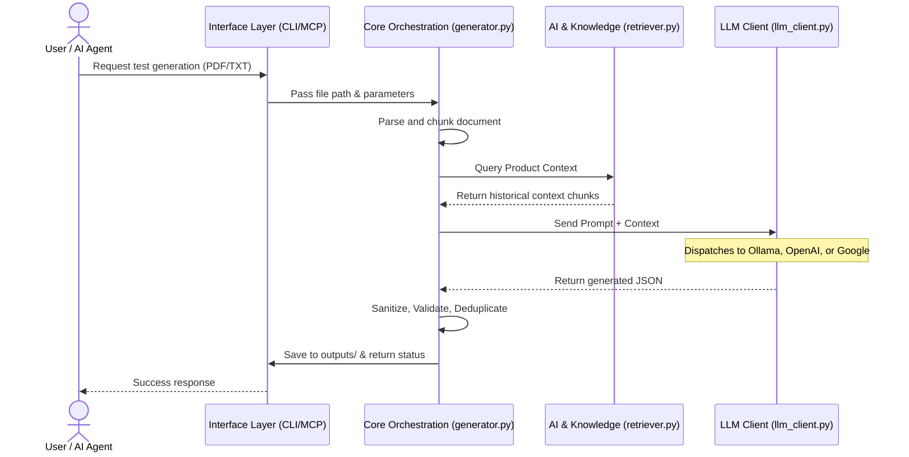

# CaseCraft

CaseCraft is an Agentic QA Engine that transforms feature requirement documents into structured, production-ready test suites. It uses local or cloud-based LLMs, Retrieval-Augmented Generation (RAG), and the Model Context Protocol (MCP) to generate comprehensive test cases grounded in your product's existing documentation.

---

## Architecture Diagram



---

## Architecture Layers

CaseCraft follows a modular three-tier architecture. Each layer has a clear responsibility and communicates with the others through well-defined interfaces.

### Layer 1: Interface Layer

The Interface Layer is the entry point for all interactions with CaseCraft. Whether a user runs a terminal command or an AI agent makes a tool call, this layer normalizes the request and hands it off to the Core Orchestration Layer. This separation ensures that the underlying test generation logic remains identical regardless of how CaseCraft is invoked.

**`cli/main.py`** — The primary CLI entry point. It uses Python's `argparse` to accept commands like `generate`, along with flags such as `--model`, `--format`, `--no-dedup-semantic`, and `--reviewer`. It resolves configuration priority (CLI arguments override config file values, which override defaults), validates input file paths, calls `generate_test_suite()`, and exports results via `core/exporter.py`. This is the recommended way to run CaseCraft for local usage.

**`cli/ingest.py`** — The ingestion CLI for populating the RAG knowledge base. It supports four sub-commands: `sitemap` (crawl all pages from a sitemap.xml), `url` (ingest a single web page), `urls` (ingest URLs from a text file), and `docs` (ingest local PDF/TXT/MD files from a directory). Each source is parsed into `RawDocument` objects, chunked, embedded, and appended to the knowledge index.

**`mcp_server/server.py`** — Exposes CaseCraft as an MCP (Model Context Protocol) server using FastMCP. It defines two tools: `generate_tests` and `query_knowledge`, which AI clients like AnythingLLM or Claude Desktop can invoke. The server implements critical security measures including path sandboxing (files must be in `features/`, `specs/`, or `docs/`), rate limiting (5-second cooldown between generation calls), input validation (app_type whitelist, query truncation), and lazy loading of heavy dependencies (PyTorch, SentenceTransformers) so that the MCP handshake completes instantly without timeout.

**`casecraft_mcp.py`** — A thin wrapper script that adds the project root to `sys.path` and calls `mcp_server.server.main()`. This is the file you point your MCP client to when configuring the server.

### Layer 2: Core Orchestration Layer

This is the central processing engine. It manages the entire pipeline: parsing documents, consulting the knowledge base, constructing prompts, calling the LLM, and post-processing results.

**`core/generator.py`** — The main orchestrator containing `generate_test_suite()`. This function:

1. Parses the input document into text chunks using `core/parser.py`.
2. Retrieves product context from the RAG knowledge base via `_retrieve_product_context()`.
3. For each chunk, runs a condensation pass (`_condense_chunk()`) to distill the text into test-relevant bullet points, then builds a prompt and generates test cases via `_generate_single_suite()`.
4. Processes all chunks in parallel using `ThreadPoolExecutor` (up to 4 workers) since LLM calls are I/O-bound.
5. Post-processes results through a multi-stage pipeline: JSON sanitization (`_clean_json_output`), output normalization (`_normalize_test_cases`), field sanitization (`_sanitize_test_cases`), title cleaning (`_clean_test_case_titles`), exact deduplication (`_deduplicate_test_cases`), semantic deduplication (`_deduplicate_semantically`), checklist cross-referencing (if a companion `_checklist.txt` file exists), priority sorting (`_prioritize_test_cases`), and dependency validation (`_validate_dependencies`).
6. Optionally runs a reviewer pass that sends the entire suite back to the LLM for polish.
7. Returns a validated `TestSuite` Pydantic model.

**`core/parser.py`** — Handles document ingestion. Supports PDF (via `pypdf`), plain text, and Markdown files. It extracts raw text, cleans it (strips redundant whitespace, normalizes line endings), and splits it into overlapping chunks. The chunker prefers to break at whitespace boundaries so words are never split mid-token. Enforces a 50MB file size limit to prevent memory exhaustion.

**`core/prompts.py`** — Manages prompt construction using Jinja2 templates stored in `prompts/templates/`. It provides four builder functions:

- `build_generation_prompt()` — The main prompt instructing the LLM to generate test cases from feature text plus optional product context.
- `build_condensation_prompt()` — Reduces a document chunk to concise, test-relevant bullet points.
- `build_reviewer_prompt()` — Instructs the LLM to review and improve an existing test suite.
- `build_cross_reference_prompt()` — Compares an existing test suite against a checklist and generates only the missing test cases.

All inputs are sanitized via `_sanitize_input()` which strips control characters and enforces a 500K character limit to mitigate prompt injection.

**`core/schema.py`** — Defines the data model using Pydantic. `TestCase` contains fields for use_case, test_case name, test_type (functionality, ui, performance, integration, usability, database, security, acceptance), preconditions, test_data (arbitrary key-value pairs), steps, priority, dependencies, tags, expected_results, and actual_results. `TestSuite` wraps a list of `TestCase` objects with the feature name and source document path.

**`core/config.py`** — Manages configuration loading with a three-level priority system: CLI arguments > Environment variables > YAML config file > Defaults. The config is defined as Pydantic models (`GeneralSettings`, `GenerationSettings`, `OutputSettings`, `QualitySettings`, `KnowledgeSettings`) and loaded from `casecraft.yaml`. Any setting can be overridden via environment variables using the convention `CASECRAFT_SECTION_KEY` (e.g., `CASECRAFT_GENERAL_MODEL`).

**`core/exporter.py`** — Exports a `TestSuite` to Excel (`.xlsx` via openpyxl) or JSON format. Includes path traversal protection — output files must be within the configured `output_dir`.

**`core/llm_client.py`** — A unified LLM adapter that routes generation requests to one of three backends based on config:

- **Ollama** (native `/api/generate` endpoint) — For locally hosted models.
- **OpenAI-compatible** (`/v1/chat/completions`) — Works with LM Studio, LocalAI, vLLM, and any OpenAI-compatible API.
- **Google Gemini** (REST API) — For Google's cloud models.

Each backend handler constructs the appropriate payload with temperature, top_p, max output tokens, and context window settings. It warns if API keys are transmitted over unencrypted HTTP to non-localhost addresses.

### Layer 3: AI & Knowledge Layer (RAG)

This layer handles all embedding, storage, and retrieval of product knowledge that provides context during test generation.

**`core/knowledge/models.py`** — Defines two data classes: `RawDocument` (text + source metadata before chunking) and `KnowledgeChunk` (text + metadata + optional embedding vector after chunking).

**`core/knowledge/chunker.py`** — Splits `RawDocument` text into `KnowledgeChunk` objects. Unlike the parser's character-based chunking, this chunker splits by paragraphs first, then merges paragraphs into chunks up to a configurable `max_chars` limit (default 1500 characters, configurable via `knowledge.kb_chunk_size`). This preserves semantic boundaries.

**`core/knowledge/embedder.py`** — Generates dense vector embeddings using SentenceTransformers (`all-MiniLM-L6-v2` by default). Supports batch processing with progress bars. When the retriever is already loaded, the embedder reuses the same model instance to save memory.

**`core/knowledge/retriever.py`** — The advanced retrieval engine using Hybrid Search:

1. **Dense Search** — Cosine similarity between query and document embeddings (weighted at 0.7 by default).
2. **Sparse Search (BM25)** — Keyword-based scoring via `rank_bm25` (weighted at 0.3 by default).
3. **Score Fusion** — Combines dense and sparse scores with configurable weights.
4. **Cross-Encoder Re-ranking** — Optionally re-ranks the top candidates using `cross-encoder/ms-marco-MiniLM-L-6-v2` for improved precision.
5. **Filtering** — Applies minimum score threshold and metadata filters.

Supports `top_k=-1` to retrieve all chunks from the knowledge base.

**`core/knowledge/loader.py`** — Scans a directory for supported files (PDF, MD, TXT), extracts text using `core/parser.py`, and wraps each file as a `RawDocument` with automatically inferred source types (feature_doc, system_rule, product_doc).

**`core/knowledge/web_loader.py`** — Fetches content from web sources. Supports sitemap crawling (with configurable delay, max pages, and URL exclusion patterns), single URL loading, and batch URL loading from text files. Implements SSRF protection: blocks private/internal IPs, validates DNS resolution, rejects non-HTTP schemes, and limits redirect chains.

**`core/knowledge/store.py`** — ChromaDB-based persistent vector store (alternative storage backend). Provides `add()` and `query()` operations for knowledge chunks.

---

## Tech Stack

| Component | Technology | Purpose |
| --- | --- | --- |
| **Language** | Python 3.10+ | Core runtime for all modules |
| **LLM Communication** | `requests` | HTTP client for Ollama, OpenAI, and Google Gemini REST APIs |
| **Data Validation** | `pydantic` v2 | Schema enforcement for config, test cases, and LLM output |
| **PDF Parsing** | `pypdf` | Text extraction from PDF feature documents |
| **Excel Export** | `openpyxl` | Writing structured test suites to `.xlsx` files |
| **Configuration** | `pyyaml` | Loading `casecraft.yaml` settings |
| **Prompt Templating** | `jinja2` | Rendering parameterized prompts for the LLM |
| **Embeddings** | `sentence-transformers` (`all-MiniLM-L6-v2`) | Generating dense vector embeddings for RAG retrieval and semantic deduplication |
| **Re-ranking** | `sentence-transformers` (`cross-encoder/ms-marco-MiniLM-L-6-v2`) | Cross-encoder re-ranking of retrieval candidates for higher precision |
| **Sparse Search** | `rank-bm25` | BM25Okapi keyword scoring for hybrid search |
| **Vector Store** | `chromadb` | Persistent local vector database (alternative to JSON index) |
| **Web Scraping** | `beautifulsoup4` | HTML-to-text extraction for web ingestion |
| **XML Parsing** | `defusedxml` | Safe sitemap.xml parsing (prevents XXE attacks) |
| **MCP Server** | `mcp` (FastMCP) | Model Context Protocol server for AI agent integration |
| **Numerical** | `numpy` | Matrix operations for cosine similarity and score computation |
| **Environment** | `python-dotenv` | Loading environment variables from `.env` files |

**Why these choices:**

- **Pydantic** ensures every LLM output strictly conforms to the `TestCase` schema. Without it, malformed JSON from the LLM would silently corrupt test suites.
- **Jinja2** separates prompt logic from prompt content, making it easy to modify prompts without touching Python code.
- **SentenceTransformers** provides high-quality local embeddings without requiring an API key or internet connection.
- **Hybrid Search (BM25 + Dense)** catches both exact keyword matches and semantic similarities, outperforming either approach alone.
- **FastMCP** enables zero-code integration with AI assistants like Claude Desktop and AnythingLLM.

---

## Configuration Reference

All settings are managed in `casecraft.yaml`. Every value can be overridden via environment variables using the pattern `CASECRAFT_SECTION_KEY` (e.g., `CASECRAFT_GENERAL_MODEL`).

### General Settings

| Setting | Default | Description |
|---|---|---|
| `model` | `llama3.1:8b` | The LLM model identifier. Must match a model available on your provider. |
| `llm_provider` | `ollama` | Backend provider: `ollama`, `openai`, or `google`. |
| `base_url` | `http://localhost:11434` | API endpoint URL for the LLM provider. |
| `api_key` | `ollama` | API key (use env var `CASECRAFT_GENERAL_API_KEY` for real keys). |
| `context_window_size` | `-1` | Context window in tokens. `-1` uses the model's default maximum. Set to 4096 or 8192 on machines with limited RAM. |
| `max_retries` | `2` | Number of retry attempts when the LLM generates invalid JSON. |
| `max_output_tokens` | `4096` | Maximum tokens the LLM can generate per call. |
| `timeout` | `600` | Request timeout in seconds for LLM API calls. |

### Generation Settings

| Setting | Default | Description |
|---|---|---|
| `chunk_size` | `1000` | Maximum characters per feature document chunk sent to the LLM. Set very high (e.g., 100000) to process the entire document as one chunk. Each chunk gets its own LLM call for test generation. |
| `chunk_overlap` | `100` | Character overlap between consecutive chunks to maintain continuity at boundaries. Only relevant when the document exceeds `chunk_size`. |
| `temperature` | `0.2` | LLM creativity (0.0-1.0). Low values produce deterministic, structured output. Recommended to keep at 0.1-0.3 for reliable JSON generation. |
| `top_p` | `0.5` | Nucleus sampling. Controls the diversity of token selection. Lower values make output more focused. |
| `app_type` | `web` | Application type: `web`, `mobile`, `desktop`, or `api`. When set to `mobile`, the prompt includes mobile-specific test scenarios (touch gestures, orientation, interruptions, offline mode, etc.). |

### Output Settings

| Setting | Default | Description |
|---|---|---|
| `default_format` | `excel` | Output format: `excel` (.xlsx) or `json`. |
| `output_dir` | `outputs` | Directory where generated test suites are saved. |

### Quality Settings

| Setting | Default | Description |
|---|---|---|
| `semantic_deduplication` | `true` | Enables embedding-based deduplication to remove semantically similar test cases across chunks. |
| `similarity_threshold` | `0.85` | Cosine similarity threshold for deduplication (0.0-1.0). Higher = stricter (only near-identical tests removed). |
| `reviewer_pass` | `false` | When enabled, sends the entire test suite back to the LLM for a quality review pass. Improves clarity but adds latency. |
| `top_k` | `5` | Number of RAG knowledge chunks to retrieve for context. Set to `-1` to retrieve ALL chunks from the knowledge base. |

### Knowledge Settings

| Setting | Default | Description |
|---|---|---|
| `kb_chunk_size` | `1500` | Maximum characters per knowledge base chunk during ingestion. Controls chunk granularity in the RAG index. |
| `min_score_threshold` | `0.1` | Minimum hybrid retrieval score to include a result (0.0-1.0). Set to `0.0` to include all chunks when `top_k` is `-1`. |

---

## Running CaseCraft

### Prerequisites

- Python 3.10 or higher
- 8GB+ RAM recommended (16GB+ if using large context windows)

### Installation

```bash
# Clone the repository
git clone https://github.com/T-Tests/casecraft.git
cd casecraft

# Install runtime dependencies
pip install -r requirements-runtime.txt

# Install ingestion dependencies (for RAG knowledge base)
pip install -r requirements-ingest.txt
```

### Configuration

Copy the example config and edit it:

```bash
cp casecraft.yaml.example casecraft.yaml
```

### Running Locally with Ollama

This is the recommended setup for fully offline, private test generation. Ollama runs LLMs directly on your machine with no API keys or internet required.

1. **Install Ollama** from [ollama.ai](https://ollama.ai/).

2. **Pull a model:**

```bash
# Balanced (recommended)
ollama pull llama3.1:8b

# Fastest (lower quality)
ollama pull llama3.2:3b

# Best for structured output
ollama pull qwen2.5:7b
```

1. **Configure `casecraft.yaml`:**

```yaml
general:
  llm_provider: "ollama"
  model: "llama3.1:8b"
  base_url: "http://localhost:11434"
  api_key: "ollama"
```

1. **Generate tests:**

```bash
python cli/main.py generate features/your_feature.pdf
```

### Running with Cloud-Based LLMs

CaseCraft supports any OpenAI-compatible API and Google Gemini. This is useful when you need higher quality output from larger models or do not want to run models locally.

**OpenAI-compatible APIs** (works with OpenAI, LM Studio, vLLM, LocalAI, Azure OpenAI, or any `/v1/chat/completions` endpoint):

```yaml
general:
  llm_provider: "openai"
  model: "gpt-4o"
  base_url: "https://api.openai.com/v1"
```

Set the API key via environment variable (never commit keys to the YAML file):

```bash
# Windows
set CASECRAFT_GENERAL_API_KEY=sk-your-key-here

# Linux/Mac
export CASECRAFT_GENERAL_API_KEY=sk-your-key-here
```

**Google Gemini:**

```yaml
general:
  llm_provider: "google"
  model: "gemini-1.5-flash"
  base_url: "https://generativelanguage.googleapis.com/v1beta"
```

```bash
set CASECRAFT_GENERAL_API_KEY=your-google-api-key
```

### CLI Usage

```bash
# Generate test cases from a feature document
python cli/main.py generate features/your_feature.pdf

# Override model from CLI
python cli/main.py generate features/your_feature.pdf --model qwen2.5:7b

# Output as JSON instead of Excel
python cli/main.py generate features/your_feature.pdf --format json

# Disable semantic deduplication
python cli/main.py generate features/your_feature.pdf --no-dedup-semantic

# Enable the AI reviewer pass
python cli/main.py generate features/your_feature.pdf --reviewer

# Verbose mode (shows tracebacks on errors)
python cli/main.py generate features/your_feature.pdf --verbose
```

Generated output is saved to the `outputs/` directory as `.xlsx` and/or `.json` files.

---

## RAG Knowledge Base Management

The RAG (Retrieval-Augmented Generation) system gives CaseCraft awareness of your product's existing behavior, documentation, and business rules. When generating test cases, relevant knowledge is automatically retrieved and injected into the LLM prompt so that generated tests align with established system behavior and cover cross-feature interactions.

### How It Works

1. **Ingestion**: Documents are parsed (PDF, TXT, MD, or web pages), split into semantically meaningful paragraph-based chunks, and embedded as dense vectors using SentenceTransformers.
2. **Storage**: Embedded chunks are stored in `knowledge_base/index.json` as a flat JSON array. Each entry contains the chunk text, metadata, and its embedding vector.
3. **Retrieval**: During test generation, the feature document text is used as a query. The retriever performs hybrid search (BM25 keyword + dense semantic) with optional cross-encoder re-ranking to find the most relevant knowledge chunks.
4. **Context Injection**: Retrieved chunks are formatted as numbered context blocks and appended to the generation prompt.

Ingestion is **cumulative** — each run appends to the existing index. Previously ingested documents are never overwritten.

### Ingesting Local Documents

```bash
# Ingest all PDF/TXT/MD files from a directory
python cli/ingest.py docs knowledge_base/raw/

# Ingest from any directory
python cli/ingest.py docs ./docs/
```

### Ingesting from the Web

```bash
# Crawl a sitemap and ingest all pages
python cli/ingest.py sitemap https://docs.example.com/sitemap.xml

# Ingest a single URL
python cli/ingest.py url https://docs.example.com/page

# Ingest multiple URLs from a text file (one URL per line)
python cli/ingest.py urls my_urls.txt
```

**Sitemap options:**

```bash
python cli/ingest.py sitemap https://docs.example.com/sitemap.xml \
    --delay 1.5 \
    --max-pages 200 \
    --timeout 30 \
    --exclude /api/ /blog/
```

### Custom Index Path

```bash
python cli/ingest.py docs ./docs/ --index knowledge_base/custom_index.json
```

### Clearing and Rebuilding the Index

There is no single-document delete. To rebuild from scratch:

```bash
# Windows
del knowledge_base\index.json
rmdir /s /q knowledge_base\chroma

# Linux/Mac
rm knowledge_base/index.json
rm -rf knowledge_base/chroma
```

Then re-ingest:

```bash
python cli/ingest.py docs knowledge_base/raw/
```

### Tuning Retrieval

By default, CaseCraft retrieves the top 5 most relevant chunks. To use the entire knowledge base as context:

```yaml
quality:
  top_k: -1

knowledge:
  min_score_threshold: 0.0
```

To increase knowledge chunk granularity during ingestion, adjust `kb_chunk_size` in the `knowledge` section and re-ingest your documents.

---

## Mobile Capabilities

When `app_type` is set to `mobile` in `casecraft.yaml`, CaseCraft activates mobile-specific test generation behavior:

1. **Prompt Enhancement**: The generation prompt adds a mobile QA persona and includes mobile-specific test categories: touch gestures (swipe, tap, long press), device orientation (portrait/landscape), system interruptions (calls, notifications, battery alerts), background/foreground transitions, network switching (WiFi/4G/offline), and more.

2. **Capabilities Excel File** (`prompts/templates/mobile_capabilities.xlsx`): This spreadsheet defines platform-specific capabilities for Android and iOS. It tracks which features are supported, which attributes are available per platform, and what is yet to be implemented. During generation, this file can be referenced to ensure tests target only supported functionality.

   **Columns**: Capabilities, Android, iOS, Supported (online/offline), Supported Attributes (Android), Yet to Support (Android), Supported Attributes (iOS), Yet to Support (iOS), Remarks.

   Keep this file updated as mobile platform support evolves.

---

## MCP Server Configuration (Experimental)

> **Note**: MCP integration has not been fully tested. The configuration below is provided for reference.

CaseCraft can be used as a tool by AI assistants that support the Model Context Protocol (MCP). The server exposes two tools:

- **`generate_tests`** — Generates a test suite from a requirement document.
- **`query_knowledge`** — Searches the RAG knowledge base for relevant product information.

### Setup for Claude Desktop

Add to your `claude_desktop_config.json`:

```json
{
  "mcpServers": {
    "casecraft": {
      "command": "python",
      "args": ["c:\\path\\to\\casecraft\\casecraft_mcp.py"]
    }
  }
}
```

### Setup for AnythingLLM

1. Go to Agent Configuration in AnythingLLM.
2. Add a new MCP server with:
   - **Command**: `python`
   - **Args**: `c:\path\to\casecraft\casecraft_mcp.py`
3. Ensure AnythingLLM is in **Agent** mode (not Chat mode).
4. Prompt the agent:
   > "Use the generate_tests tool to create test cases for features/your_feature.pdf"

### Security

The MCP server enforces:

- **Path sandboxing**: Files must be in `features/`, `specs/`, or `docs/` directories.
- **Rate limiting**: 5-second cooldown between generation calls.
- **Input validation**: App type whitelist, query length truncation.
- **Lazy loading**: Heavy ML dependencies load on first tool call, not at startup.

---

## Sample Features

The `sample features/` directory contains example feature files demonstrating the expected format for input documents. Use these as templates when creating your own feature files in the `features/` directory. Include detailed acceptance criteria and relevant context to improve test generation quality.
