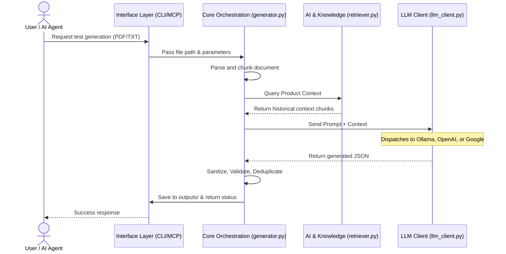

# CaseCraft Architecture Documentation

CaseCraft is an Agentic QA Engine that turns feature requirements into structured test suites using Native LLMs, RAG, and MCP. This document outlines the technical architecture, layer details, module communication, and setup instructions.

---

## 🏗️ Architecture Diagram



---

## 📚 Architecture Layers Explained

The CaseCraft system follows a clean, modular, three-tier architecture separating the user interface from the business logic and external integrations.

### 1. Interface Layer

This layer handles all incoming requests and routes them to the core orchestration engine. It ensures that regardless of how the user runs CaseCraft, the underlying execution remains identical.

* **CLI (Command Line Interface)**: Allows direct terminal execution for generating tests and ingesting documents into the RAG database.
* **MCP Server (Model Context Protocol)**: Exposes `generate_tests` and `query_knowledge` as standard tools to AI clients like AnythingLLM, Claude Desktop, and Cursor. It acts as a bridge between your local AI assistant and the CaseCraft engine.

### 2. Core Orchestration Layer

The "brain" of CaseCraft. It manages the end-to-end pipeline of reading a document, breaking it down, consulting the knowledge base, calling the LLM, and saving the results.

* **Pipeline Execution**: Manages chunking of large files, processing each chunk, and merging results.
* **Data Validation**: Enforces strict JSON schemas using Pydantic, ensuring the LLM output is structurally sound.
* **Quality Control**: Performs exact and semantic deduplication to remove redundant test cases generated across different chunks.

### 3. AI & Knowledge Layer

This layer abstracts remote or local AI dependencies.

* **LLM Client**: A unified driver that communicates with Ollama (Local), Google Gemini, or OpenAI-compatible endpoints.
* **RAG System**: A local vector database (ChromaDB) that stores historical project context. It ensures newly generated tests don't contradict established system behaviors.

---

## 🧩 Main Code Components

### `cli/main.py` & `cli/ingest.py`

* **Role**: Application entry points.
* **Details**: `main.py` parses arguments like `--app-type` and `--custom` to override `casecraft.yaml` settings dynamically, triggering test generation. `ingest.py` handles parsing URLs/PDFs and pushing them into the local vector database.

### `mcp_server/server.py`

* **Role**: FastMCP application wrapper.
* **Details**: Defines the `@mcp.tool()` endpoints. Critical for security: it sandboxes file paths (`_validate_file_path`) and implements **lazy loading** of heavy modules (like PyTorch) so the MCP handshake completes instantly without timing out.

### `core/generator.py`

* **Role**: The heavy lifter for test generation.
* **Details**: Contains `generate_test_suite()`. It breaks documents into chunks, retrieves product context via RAG, builds Jinja2 prompts, makes resilient calls to the LLM (with retries for bad JSON), sanitizes outputs, and performs deduplication (`_deduplicate_semantically`).

### `core/llm_client.py`

* **Role**: Universal LLM adapter.
* **Details**: The `LLMClient` class routes generation requests to `_generate_ollama`, `_generate_openai_compatible`, or `_generate_google` based on the `casecraft.yaml` config. It handles network timeouts and REST payloads.

### `core/knowledge/retriever.py`

* **Role**: Context provider.
* **Details**: Instantiates a ChromaDB client. Given a document chunk, it searches the database for the top-K most similar historical documents to inject into the LLM prompt.

---

## 🔄 Inter-Layer Communication

1. **Request Initiation**: The user runs a CLI command or an AI Agent triggers an MCP tool call. The Interface Layer validates the requested file path.
2. **Orchestration Hand-off**: The Interface passes the file path and any configuration overrides (e.g., app type) to `core.generator.generate_test_suite()`.
3. **Context Retrieval**: `generator.py` chunks the document and asks `retriever.py` (AI & Knowledge Layer) for relevant background info from the Vector DB.
4. **Prompt Resolution**: `generator.py` combines the chunk, the retrieved context, and the system prompts.
5. **LLM Execution**: `generator.py` calls `llm_client.py.generate()`. The `LLMClient` reads `core.config` to determine which provider to use and handles the network request.
6. **Response & Validation**: The LLM returns a string. `generator.py` parses it, coerces it into `core.schema.TestSuite`, sanitizes fields, and deduplicates.
7. **Data Export**: Final validated data is sent to `core.exporter.py` to be written to disk as `.xlsx` and `.json`. The path of the generated file is returned to the Interface Layer.

---

## 🚀 Setup & Execution Guide

### 1. Prerequisites

* Python 3.10+
* [Ollama](https://ollama.ai/) (if running locally)

### 2. Installation

```bash
# Clone the repository
git clone https://github.com/T-Tests/casecraft.git
cd casecraft

# Install dependencies
pip install -r requirements-runtime.txt
pip install -r requirements-ingest.txt

# Download default local model
ollama pull llama3.2:3b
```

### 3. Configuration

The repository includes a `casecraft.yaml.example` file with default settings. You must copy this to `casecraft.yaml` to configure the application:

```bash
cp casecraft.yaml.example casecraft.yaml
```

Once copied, edit `casecraft.yaml` to set your preferred LLM provider, models, and generation parameters:

```yaml
general:
  llm_provider: "ollama"           # Options: ollama, openai, google
  model: "llama3.2:3b"             # Or gemini-1.5-flash
  base_url: "http://localhost:11434" # Or https://generativelanguage.googleapis.com/v1beta
generation:
  app_type: "web"                  # Options: web, mobile, desktop, api
```

*Tip: Set API keys via environment variables (e.g., `CASECRAFT_GENERAL_API_KEY`).*

### 3.1 Using GitHub Copilot (GitHub Models)

You can use GitHub Copilot's underlying LLMs (like GPT-4o) as the brain for CaseCraft. Configure your `casecraft.yaml` to use the GitHub Models API (which is OpenAI compatible):


```bash
# Install OpenAI dependency
pip install openai
```

```yaml
general:
  llm_provider: "openai"
  model: "gpt-4.1-nano"
  base_url: "https://models.github.ai/inference"
```

*Note: You must set the environment variable `CASECRAFT_GENERAL_API_KEY` to your GitHub Personal Access Token (PAT) with Copilot access.*

### 4. Running via CLI

Run CaseCraft directly from your terminal:

```bash
# Generate tests for a feature document
python cli/main.py generate features/file_name.pdf

# Ingest documentation into RAG Knowledge base
python cli/ingest.py docs ./docs/
```

### 5. Running via MCP (AnythingLLM / Claude)

CaseCraft can be used as a smart tool by AI clients.

1. **Add Server**: Configure your AI client (AnythingLLM or `claude_desktop_config.json`) to run the server script:
    `Command: python` | `Args: c:\path\to\casecraft\casecraft_mcp.py`
2. **Restart Client**: Ensure your AI client recognizes the new tools (`generate_tests`, `query_knowledge`).
3. **Prompt the Agent**:
    > *"Use the generate_tests tool to create test cases for features/Activity_management.pdf"*

**(Note: Ensure AnythingLLM is in 'Agent' mode, not 'Chat' mode, and that file generation targets the `features/` directory.)**

---

## 🗂️ Directory Guide

### `features/`

This folder contains **feature documents** that you want to generate test cases from (PDF, MD, TXT, etc.).

* **Best Practice**: One feature per file works best. Include acceptance criteria for comprehensive coverage.
* **Usage**: Pass these paths to the CLI/MCP (e.g., `python cli/main.py generate features/your_feature.pdf`).

### `knowledge_base/`

This folder contains the product knowledge used for **RAG (Retrieval-Augmented Generation)**. During test generation, CaseCraft automatically searches the index here to include relevant context in the LLM prompt.

* `index.json` & `chroma/`: Vector embeddings. Do not edit manually. Delete them to rebuild the index from scratch.
* `raw/`: Put your source documents here for ingestion (`features/`, `product_docs/`, `system_rules/`).

**How to Add Knowledge:**

```bash
# From Local Documents
python cli/ingest.py docs knowledge_base/raw/

# From Websites (Sitemap or Single URL)
python cli/ingest.py sitemap https://docs.example.com/sitemap.xml
python cli/ingest.py url https://docs.example.com/page

# From URL List File
python cli/ingest.py urls my_urls.txt
```

**How to Remove Knowledge (Clear Index):**
There are no single-document delete commands. To clear the knowledge base or rebuild it from scratch, delete the index files:

```bash
# Windows
del knowledge_base\index.json
rmdir /s /q knowledge_base\chroma

# Mac/Linux
rm knowledge_base/index.json
rm -rf knowledge_base/chroma
```
